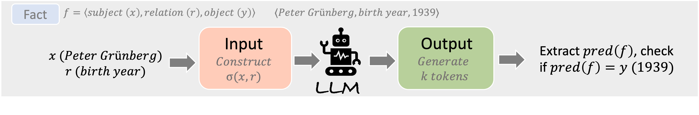
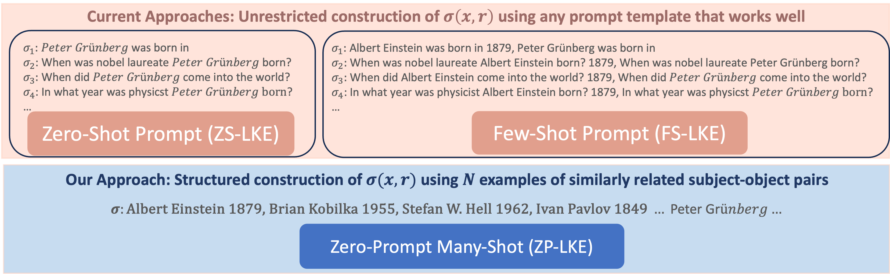

# Reliable Latent Knowledge Estimation in LLMs

This repository contains the official implementation for the paper:
["Towards Reliable Latent Knowledge Estimation in LLMs: Zero-Prompt Many-Shot Based Factual Knowledge Extraction" (WSDM 2025)](https://arxiv.org/abs/2404.12957)

The paper tackles the problem of estimating factual knowledge within large language models (LLMs) without relying on prompt engineering, which can often skew results or require extensive tuning. Our method, the Zero-Prompt Latent Knowledge Estimator (ZP-LKE), leverages many-shot examples to communicate factual relationships directly, avoiding the pitfalls of manually designed prompts. This approach is straightforward, reliable, and model-agnostic, allowing us to systematically compare and analyze the factual knowledge embedded in any open-source LLMs.

## Overview

The code provides tools for estimating latent knowledge in large language models (LLMs) using our novel zero-prompt Latent Knowledge Estimator (LKE) and any other prompt-based estimators.

Latent Knowledge Estimator (LKE) aims to reliably measure factual knowledge embedded within LLMs. This repository provides:

- Zero-prompt LKE (ZP-LKE), a reliable, prompt-free estimation approach leveraging in-context examples for accurate factual knowledge extraction.
- Support for any custom prompt types (e.g., human-generated or machine-mined prompts).
- A configurable pipeline to evaluate model knowledge, supporting various datasets.




## Requirements

- vLLM >= 0.4.1

## Installation

```bash
git clone [https://github.com/QinyuanWu0710/ZeroPrompt_LKE.git]
cd [ZeroPrompt_LKE]
pip install -r requirements.txt
```

## Quick Start

### Dataset

The proposed dataset is available on Huggingface: [https://huggingface.co/datasets/QinyuanWu/T-Rex-MC]. You may also use your own dataset in a compatible format.

The default configuration for testing is provided in config/test.yaml. To test knowledge estimation, run:
```bash
python -m main
```

## Configuration

The default configuration file is located at `.../config/test.yaml`. You can modify the following parameters:

```bash
--config_path: Path to the configuration file
--model_name: Name of the LLM to test (default: llama2-7b)
--test_relation_id: Test relation ID (default: 1)
--lke_type: LKE type (default: zp-lke)
--lke_index: LKE index (default: 0)
--example_num: Number of examples (default: 50)
--num_options: Number of options (default: 100)
```

## Customization

To modify the prompts:
1. Human-generated prompts (HGPs): Edit `.../latent_knowledge_extractor/prompt_template.py`
2. Machine-mined prompts (MMPs): Edit the same file

## Results

The system provides two types of evaluation:
1. Multiple Choice Test: Returns accuracy and probability mass of correct answers
2. Open Generation Test: Returns generation accuracy

## Citation

If you use this code in your research, please cite our paper:

```bibtex
@article{wu2024towards,
  title={Towards Reliable Latent Knowledge Estimation in LLMs: In-Context Learning vs. Prompting Based Factual Knowledge Extraction},
  author={Wu, Qinyuan and Khan, Mohammad Aflah and Das, Soumi and Nanda, Vedant and Ghosh, Bishwamittra and Kolling, Camila and Speicher, Till and Bindschaedler, Laurent and Gummadi, Krishna P and Terzi, Evimaria},
  journal={arXiv preprint arXiv:2404.12957},
  year={2024}
}
```

## License

```
Apache License
Version 2.0, January 2004
http://www.apache.org/licenses/
```

## Contact

For questions and feedback, please open an issue in the repository.
